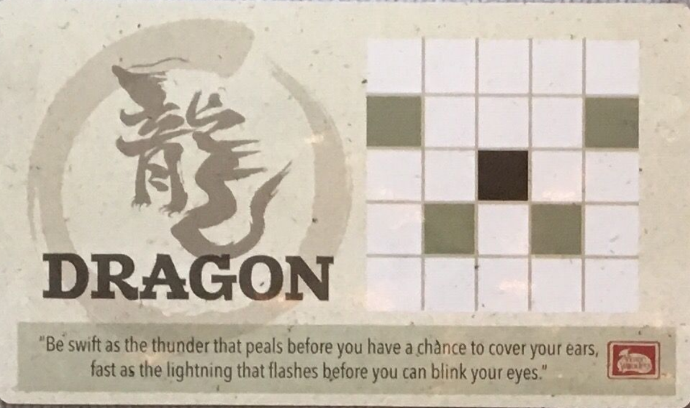

# Assignment 1 Instructions

For this assignment, we are going to be creating a program that lets you play a game of Onitama.

You will be graded on:

-   Code Correctness (based on autotests -- so make sure you DO NOT modify any method names): 50%
-   Documentation (having proper, complete documentation for all your code): 40%
-   Testing (using pytest to create a robust test suite for OnitamaGame and OnitamaBoard): 10%

If you are unfamiliar with this game, make sure to check out these links first:

https://www.youtube.com/watch?v=IFRewjcngwU

https://www.arcanewonders.com/resources/Onitama_Rulebook.PDF

## Section 0 - Making a Test Suite.

We are going to follow test-driven development for this assignment to introduce you to good coding practices.

This means, that before we even start coding anything for our game, we will make test cases to ensure that when we start writing our code for the main program, we will know if it is working as expected or not.

Although you may see a lot of files in the starter code and may get flustered, most of them are for the GUI program, and the others have the code completed for you.

You will only be working on `OnitamaGame.py` and `OnitamaBoard.py`. Hence, you are only required to make test cases for these two files.

As far as testing goes, we want rigerous tests for the following methods in the respective files:

### OnitamaGame_Tests.py

-   `other_player`
-   `get_token`
-   `is_legal_move`
-   `move`
-   `get_winner`
-   `undo`

### OnitamaBoard_Tests.py

-   `construct_styles`
-   `exchange_style`
-   `valid_coordinate`
-   `get_token`
-   `set_token`

> What does rigerous testing mean?????

It means that you are required to do two things.

1. Make doctests for all of these methods, **at least 3 unique** tests.
2. Make pytests for all of these methods, pytests should be more _in-depth_ than the doctests.

**Tips**:

-   Revisit the course notes from Week 1, specifically [1.5](https://mcs.utm.utoronto.ca/~148/notes/testing/how_to_test.html), [1.6](https://mcs.utm.utoronto.ca/~148/notes/testing/choosing_tests.html), [1.7](https://mcs.utm.utoronto.ca/~148/notes/testing/hypothesis.html).
-   Make sure to test for different properties of the variables that you want to test, this is what we mean by the **uniqueness** of tests, for example, if you are testing `get_token`, you may want to test for:

    1. Valid coordinates
    2. Coordinates clearly out of range (negative or greater than the size)
    3. Coordinates on the boundary of the size (0 and 5).

-   You may find using the `hypothesis` module useful, [here is the documentation for it](https://hypothesis.readthedocs.io/en/latest/quickstart.html), so you can **learn** how to use external modules for your own use!

## Constants for Onitama in `Pieces.py`

To practice good code design, we have declared some constants that you must use when completing this assignment.

You will find them in `Pieces.py` and one of them in `ImageGenerator.py`, which is the super class of `Pieces` (so using inheritance, all of them are accessible in `Pieces`).

These are the five that you need to worry about:

1. **G1**: The character which will represent the grand master for player1.
2. **G2**: The character which will represent the grand master for player2.
3. **M1**: The character which will represent the monk for player1.
4. **M2**: The character which will represent the monk for player2.
5. **EMPTY**: The character which will represent an empty space on the board which is not occupied by any token.

With that out of the way, you are ready to start working on the code for Assignment 1!

## Section 1 - Completing `OnitamaBoard.py`

### Task 1.1: Warmup

Complete the easy methods in OnitamaBoard.py:

-   `valid_coordinate`, `get_token`, `set_token`,

### Task 1.2: construct_styles Method

Complete the method `construct_styles` in `OnitamaBoard.py`, based on the method documentation.

In a normal Onitama game, there are 16 different styles
that the players choose from. However, for simplicity we will
only be using 5 of these styles (Crab, Horse, Mantis, Rooster, and Dragon), as you can see below.

Each style represents a unique movement pattern.
In this pictures, the black square is the starting position,
and the other shaded squares are the destinations that the token
is able to reach using the respective movement style.

For example, let's consider the Crab style.

Let (r, c) represent the black square, the starting position,
where r is the row, and c is the column.

Then, we are able to reach the following positions, relative to the starting position:

-   ( r - 1 , c )
-   ( r, c - 2 )
-   ( r, c + 2 )

### Styles and their Movement Patterns:

### Crab


### Horse


### Mantis


### Rooster


### Dragon



This method will distribute the five styles that we are
using to the two players.

Normally, players would pick the styles randomly, however for this assignment,
we will distribute them consistently each time.

-   Player 1 (G1) should start with **Crab** and **Horse**.
-   Player 2 (G2) should start with **Mantis** and **Rooster**.
-   The extra style (EMPTY) should be **Dragon**.

This is so we can guarantee consistency when testing the program.

### Task 1.3: OnitamaBoard Constructor

Complete the OnitamaBoard constructor in `OnitamaBoard.py`, based on the method documentation.

You'll notice that we are using some optional parameters in this initializer.

#### `__init__(self, size: int, player1: Player, player2: Player, board: Union[List[List[str]], None] = None)`

#### Case 1: Board is Not None:

For this constructor, if we have a board parameter we want to construct a _preset_ Onitama board!

Use the given board parameter which is a **size x size** List of strings to initialize this OnitamaBoard.

#### Case 2: Board is None:

For this constructor, we want to construct an empty Onitama board
with dimension **size x size**.

In addition to this, we want to place the four monks and the 1 grandmaster on opposite sides of the board
for each player. We want the board to look like the following (for `size = 5`):

```
  0 1 2 3 4
 +-+-+-+-+-+
0|x|x|X|x|x|0
 +-+-+-+-+-+
1| | | | | |1
 +-+-+-+-+-+
2| | | | | |2
 +-+-+-+-+-+
3| | | | | |3
 +-+-+-+-+-+
4|y|y|Y|y|y|4
 +-+-+-+-+-+
  0 1 2 3 4
```


However, the grid should not be all hardcoded!

Remember, that there is a size parameter, so what would you do if size > 5?

#### Case: Size > 5

We require that you satisfy the following **4** conditions:

1. Even sizes raise exceptions (size must be odd)
2. The grandmaster must be in the center column
3. The monks should be placed in _all other_ columns
4. The pieces for Player X must be placed on the 0'th row.
   The pieces for Player O must be placed on the {size - 1}'th row

Keep these things in mind, when implementing the constructor!

Lastly, we want to distribute the 5 styles to the players.

Hint: You just completed a helper for this... USE IT!!

### Task 1.4: exchange_style Method

Complete the method `exchange_style` in `OnitamaBoard.py`, based on the method documentation.

In Onitama, when a player does a move with a certain style (in our case it will be one of Crab, Horse, Mantis, Rooster or Dragon),
they swap the style they just used with the EMPTY/Unowned style.

Remember, that each player has 2 styles, but we have a total of 5 styles,
so one of these styles will NOT have an owner (G1 or G2), rather, their owner will be EMPTY.

For this method, we want to exchange the given style with the EMPTY/Unowned style. This involves swapping their owners if possible.

### Task 1.5: Clean up OnitamaBoard.py

Fix any issues you find, clean up your code, avoiding repeated code, using helper functions appropriately, etc.).

## Section 2 - Implementing the Stack ADT

You will be required to implement the **Stack ADT** for this assignment.

> Where is the starter code for this?????????????

Non-existent. This is for you to implement however you want by reading the code inside of `OnitamaGame.py`.

You will see the relevant type annotations inside of this class which will help you name the class you are required to implement.

Also look out for where that attribute is being used inside of the code and how it is being used to figure out which methods you will need.

## Section 3 - Completing OnitamaGame.py

### Task 3.1: Onitama Easy Methods

Complete the easy methods in `OnitamaGame.py` based on the method documentation:

-   `other_player`, `get_token`,

Hint: For `get_token` do not repeat the code from `OnitamaBoard.py`, you can instead use that method as a helper!

### Task 3.2: is_legal_move method

Complete the method `is_legal_move` in `OnitamaGame.py`, based on the method documentation.

This method is going to be a helper for the next task.
It checks if a move with the starting position `(row_o, col_o)` to the target position `(row_d, col_d)` is valid.

For a move to be valid, it must satisfy the following criteria:

1. The starting and target positions must be in the bounds of the board.
2. The token at the starting position must belong to the current player who is trying to make this move.
3. The destination position **must NOT** belong to the current player. In other words, it must be EMPTY or belong to the opposing player.

**IMPORTANT: This method does not check if the move follows a valid movement style**

### Task 3.3: move Method

Complete the `move` method in `OnitamaGame.py`, based on the method documentation and the
hints provided within the comments in the file. Try to keep your code short
and clean, using helper methods from this class and the OnitamaBoard class as appropriate.

This method takes in the starting position `(row_o, col_o)` and the target/destination position `(rowD, col_d)` that a player is going
to 'move to' (move from starting position to the destination position), and the name of the style that they are using (styleName).

If the move is not valid from the conditions in `is_legal_move` or the move does not follow the movement pattern from the given style (remember each style has a unique movement pattern), do nothing to the board and
return False.

If the move is valid, then we need to do the following (the order is not necessarily the same order that you should implement it in):

-   Store the current state of the board and styles into our `OnitamaStack`.

-   Exchange the current player's styles.

-   Move the token from starting position to the destination position.

-   Update whose_turn to be the next player's turn.

-   return True, since this was a successful operation.

For example, if my board looked like below:

```
  0 1 2 3 4
 +-+-+-+-+-+
0|x|x|X| |x|0
 +-+-+-+-+-+
1| | | | | |1
 +-+-+-+-+-+
2| | | |x| |2
 +-+-+-+-+-+
3| | | | |y|3
 +-+-+-+-+-+
4|y|y|Y| |y|4
 +-+-+-+-+-+
  0 1 2 3 4
```


Then if I wanted to make a move `(row_o = 3, col_o = 4, row_d = 2, col_d = 3, style_name = "mantis")` with player 'Y', then this would be a valid move and we would eliminate player 'X's monk at the position (2, 3) and move player 'Y's monk to the position (2, 3).


The updated board would look like the following:

```
  0 1 2 3 4
 +-+-+-+-+-+
0|x|x|X| |x|0
 +-+-+-+-+-+
1| | | | | |1
 +-+-+-+-+-+
2| | | |y| |2
 +-+-+-+-+-+
3| | | | | |3
 +-+-+-+-+-+
4|y|y|Y| |y|4
 +-+-+-+-+-+
  0 1 2 3 4
```


### Task 3.4: get_winner method

Complete the `get_winner` method in `OnitamaGame.py`, based on the method documentation. Again, keep
your code short and clean. Use the G1, G2 and EMPTY variables from the `OnitamaBoard`
class to access the needed character tokens.

There are 2 winning conditions:

1. A player has captured the opponent's grandmaster.
2. A player has reached the starting position of the opponent's grandmaster.

Here are 4 very basic game states to represent player victories.

**X wins by condition 1.**

```
  0 1 2 3 4
 +-+-+-+-+-+
0| | | | | |0
 +-+-+-+-+-+
1| |y| | |x|1
 +-+-+-+-+-+
2| | |X| | |2
 +-+-+-+-+-+
3| | | | |o|3
 +-+-+-+-+-+
4| | | | | |4
 +-+-+-+-+-+
  0 1 2 3 4
```

**X wins by condition 2.**

```
  0 1 2 3 4
 +-+-+-+-+-+
0| | | | | |0
 +-+-+-+-+-+
1| | | | | |1
 +-+-+-+-+-+
2| | |Y|y| |2
 +-+-+-+-+-+
3| | | | | |3
 +-+-+-+-+-+
4| | |X| | |4
 +-+-+-+-+-+
  0 1 2 3 4
```

**Y wins by condition 1.**

```
  0 1 2 3 4
 +-+-+-+-+-+
0| | | | | |0
 +-+-+-+-+-+
1| |x| | | |1
 +-+-+-+-+-+
2| | |Y| | |2
 +-+-+-+-+-+
3| | | |x| |3
 +-+-+-+-+-+
4| |y| | | |4
 +-+-+-+-+-+
  0 1 2 3 4
```

**O wins by condition 2.**

```
  0 1 2 3 4
 +-+-+-+-+-+
0| | |Y| | |0
 +-+-+-+-+-+
1| | | | | |1
 +-+-+-+-+-+
2| |x|X| | |2
 +-+-+-+-+-+
3| | | | | |3
 +-+-+-+-+-+
4| | | | | |4
 +-+-+-+-+-+
  0 1 2 3 4
```

### Task 3.5: Run main.py and play the game

After the previous tasks have all been completed, you should be able to run `main.py` to run the GUI so you can play the game!

Fix any issues you find, clean up your code, avoiding repeated code, using helper functions appropriately, etc.)

## GUI Instructions


### The Basics

There are 3 steps to making a move on the gui.

**1. Choose a piece.**

-   Now you can see all the valid destinations that you can move your piece, however clicking on them won't make a move yet since you
    need to choose a style to move with.
-   You can only move pieces which are the current player's turn, if the piece is highlighted green, then you can move it, red means it is invalid.

**2. Choose a style.**

-   Pick a style that your player owns, this will be indicated by the green highlighting when you hover or click on the card. The dimmed styles are not usable by this current player.
-   Player 1's style's are located on top of the board.
-   Player 2's style's are located on the bottom of the board.
-   The fifth/extra style is located on the left side of the board.
-   A style can be unselected by clicking it again or clicking a different style.

**3. Choose a destination.**

-   Pick one of the blue highlighted tiles for the piece that you chose earlier. Picking any other tile will not make the move, and you will see it become red.
-   Clicking on one of these tiles will make the move and move the piece to that location.

**Note:** Steps 1 and 2 are interchangeable with the caveat that after selecting a style, the destination tiles (blue highlighted tiles which you can move to), will be filtered for that tile only.

### Button Panel

On the right side of the board, you will see 5 buttons.

The first 3 buttons, **HvH, HvR, RvR** represent the 3 game modes.

By default the game mode is set to HvH.

The current game mode will be highlighted green.

#### HvH

This is the default game mode and is Human vs Human.

The name should be self-explanatory, it sets both of the players to human controlled players.

#### HvR

This is the Human vs Random game mode.

This sets the **other player** to a `PlayerRandom` and they will make random moves.

Note: This is relative to the current player. So if the current move is for Player G1, then Player G2 will become random.
On the otherhand, if the current move is for Player G2, then Player G1 will become random.

#### RvR

This is the Random vs Random game mode.

This sets both players to `PlayerRandom` and they will make random moves.

Essentially, this runs a simulation of the game with 0.5 seconds of delay per move.

To stop this at any time, you can switch the game mode and proceed.

The last 2 buttons represent actions you can do to change the state of the board.

#### Undo

This uses the stack that you implemented to revert to the previous state of the game. If you try using this at the beginning of the game, nothing should happen because there are no previous states. Notably, this **should not crash** the program, if it does, there might be an error in your implementation of the stack.

#### Reset

This resets the game to the initial state and sets the game mode to HvH.

Essentially, use this button to restart the game after the game is over or if you are tilted and are losing badly.

### Game Over:

When the game ends, you will not be able to make any moves on the board. The game mode gets switched to HvH if you press the undo move to allow you to take control again and play the game.

### Video Demo

[Watch a short demo of the GUI features!](https://youtu.be/bdKpELpqO6s)

## Section 4 - Completing Documentation!

There are quite a few classes which the code is complete for, however it is missing documentation (Deval forgot to document his code?!??!?! #BlameDeval)!

It's time for you to use your _code reading_ skills and complete the documentation and type annotations for the following classes and all of the methods inside of them.

**Note**: You are _not required_ to add doctests for these classes and methods.

Please complete the documentation and type annotations for the following classes (and their attributes) and all methods inside of them by following the [function design recipe](https://mcs.utm.utoronto.ca/~148/notes/python-recap/function_design_recipe.pdf) and the [class design recipe](https://mcs.utm.utoronto.ca/~148/notes/object-oriented-programming/class_design_recipe.pdf):

-   `Turn.py`
-   `Player.py`
    -   **Important Note:** Do not worry about adding the type annotation for the `set_onitama` method, as it will require you to import `OnitamaGame` which results in a circular import and python will cry.
-   `Style.py`

**Note**: You are _not required_ to write docstrings to any of the other classes in this assignment.

This section should not be too difficult considering everything previous to this, however documenting code is very important and will be a significant portion of your mark for this assignment!

## Section 5 - Relax!

**Congratulations on finishing A1!!!**


Take some time to relax and do some things you enjoy, since we know that university is stressful at times (we were all in your position not too long ago).

Go play some games, watch shows/anime, read a book, draw something, or do literally anything that you love to do so you can de-stress!

Here's a [great video](https://www.youtube.com/watch?v=dQw4w9WgXcQ) I watch to celebrate completing assignments!
